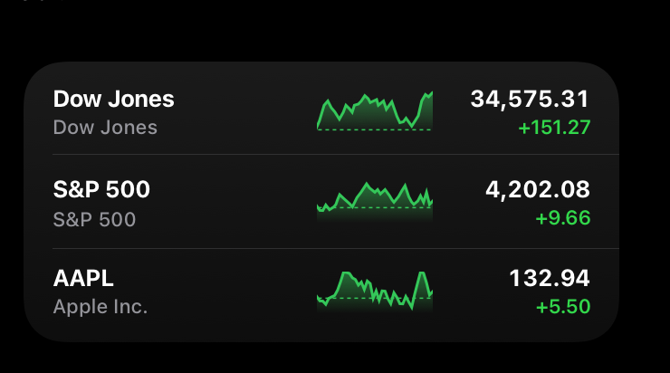

# Technical Challenge: Smart Feed Card

Welcome! This task simulates a real feature you’ll ship at Mythic Labs: a pixel‑perfect card widget that streams live token prices from the Hyperliquid blockchain.

> Goal: Implement a reusable React widget that displays three coins with a price, sparkline, and 24 h % change).

# 1. Context

One of our core features is a **Smart Feed**. This will be a crypto trader’s personalized intelligence stream. Think _Bloomberg Terminal meets iOS widgets_.

Instead of scrolling endless charts, our users glance at bite‑sized cards that surface the highest‑leverage signals (price momentum, whale flows, volume spikes) and actionable AI commentary.

Here’s an example of the type of card widget that could show up in our Smart Feed:



## The Feature

Recreate the card widget above and display price data for the following three coins:

1. Bitcoin (symbol: BTC)
2. Solana (symbol: SOL)
3. Fartcoin (symbol: FARTCOIN)

To get the real-time price data, subscribe to Hyperliquid’s websocket channel for each coin and render live updates every time we receive a new price from the websocket (every ~2 to 4 seconds).

> Tip: Check out the Hyperliquid websocket docs here: https://hyperliquid.gitbook.io/hyperliquid-docs/for-developers/api/websocket/subscriptions. You’ll need to subscribe to the `activeAssetCtx` subscription type for each coin and store the `markPx` (ie mark price) and `prevDayPx` (ie previous day price). With this, you can display the current price, change24h, and sparkline (as seen in the example above). Note: In prod we’ll proxy these prices through our backend but a direct feed is fine for this exercise.

## What is Hyperliquid?

Hyperliquid is the blockchain we’ll be building on top of. They average around $4B in daily trading volume. Hyperliquid is the fastest growing blockchain for crypto trading and has a passionate ecosystem of builders.

## UI Goals

- Pixel‑perfect match to the reference example.
- Smooth **green/red** color transitions on %-change.
- Render a real-time sparkline using react-sparklines (or any lightweight charting library).
- Reusable components: `Card`, `TickerRow`, `SparklineChart`.

# 2. High‑Level Requirements

| Topic             | Must‑Have                                                                                                     |
| ----------------- | ------------------------------------------------------------------------------------------------------------- |
| **UI Polish**     | Match the provided example.                                                                                   |
| **Realtime Data** | Stream live trades via Hyperliquid WebSocket https://api.hyperliquid.xyz/ws and update in‑memory state.       |
| **Architecture**  | Clean, reusable components (`Card`, `TickerRow`, `SparklineChart`). State via React Context/Zustand/TanStack. |
| **Dev XP**        | Modern React setup (Typescript recommended). Push to GitHub, write README and record ≤ 3‑min Loom.            |

> Time‑box: Please spend no more than 4 hours. If you breeze through these requirements, tackle stretch goals (see below), but only after polishing fundamentals.

# 3. Getting Started

1. **Fork this repository** to your own GitHub account (keep it private to avoid sharing solutions with other candidates)
2. **Clone your fork** and set up your preferred React development environment
3. **Build the widget** using your chosen tech stack
4. **Push your solution** to your private fork when complete

```bash
# Example setup (adjust to your preferences)
git clone https://github.com/YOUR_USERNAME/frontend-technical-challenge.git
cd frontend-technical-challenge

# Set up your React project (Vite, Next.js, CRA, etc.)
npm create vite@latest . -- --template react-ts
npm install

# Start building!
npm run dev
```

# 4. Deliverables

1. **GitHub repo** – Keep your fork private and invite @musashi-mythic-labs as a collaborator.
   - Clean project setup with clear commits & messages
   - `README.md` covering setup, trade‑offs, and what you’d improve with more time.
2. **Loom walkthrough** – ≤ 3 min demo: UI tour, code architecture, decision highlights.

# 5. Stretch Goals

- Link to a deployed preview on Vercel
- Use the [OpenAI Responses API](https://platform.openai.com/docs/guides/text?api-mode=responses&lang=javascript) to generate an LLM-powered insight every 60 seconds
- Slide-in animation for card mount and a subtle flash when the %-change flips sign
- Light / dark theme toggle
- Any other ideas you have in mind

# 6. After Submission

We’ll review within 24h and schedule a 30 min call to:

1. Walk through key code paths together.
2. Discuss alternative implementations.
3. Chat about how you’d evolve the feature in the future.

Thank you for taking the time, excited to see what you build!
